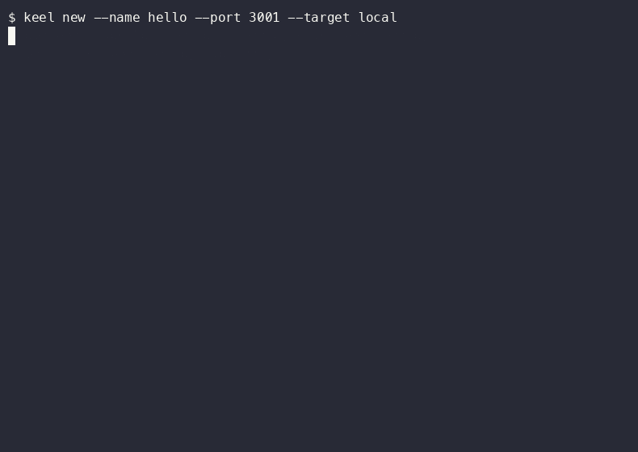

# Keel

Deploy an app, managed Postgres, and GoTrue authentication into **your own AWS
account**. Keel is a self-hosted Render/Supabase alternative: you own the
infrastructure and pay only for the AWS resources you choose to run.

Keel has three core pieces:

- **Deploy:** builds a Dockerfile from your GitHub repo and runs it on ECS/Fargate.
- **Managed Postgres:** creates a shared or dedicated RDS database and injects
  `DATABASE_URL` into linked apps.
- **Auth:** runs a GoTrue service backed by that database and injects
  `GOTRUE_URL` and `JWT_SECRET` into linked apps.

The AWS control plane uses DynamoDB, ECR, CodeBuild, Lambda, and SSM Parameter
Store. It is serverless while idle; deployed apps, databases, and load balancers
have their normal AWS costs. See the [architecture guide](docs/GUIDE.md#1-architecture)
for details.

**Tested:** 132 passing unit tests (`npm test`); they need no AWS account or
network access.

## Demo



*90 seconds, unedited: register an app, deploy it to a local Docker container,
check status, hit it with curl, tail logs, and tear it down. The walkthrough
below deploys the AWS target with Postgres and auth.*

## End-to-end AWS walkthrough

This walkthrough creates a Keel control plane, a database, an auth service, and
an app linked to both. It makes AWS resources; do it in an account and region
you control.

### Prerequisites

- Node.js 20 or newer, and the Keel CLI built or installed.
- An AWS account with the AWS CLI configured. A dedicated profile is recommended.
- A GitHub repository containing the app and a `Dockerfile`.
- For a private GitHub repository, a fine-grained token with `Contents: read`.

### 1. Set up Keel once

Choose your AWS profile and region. The default ingress mode exposes apps by
port; use `--ingress domain --domain apps.example.com` when you have a Route 53
hosted zone and want HTTPS subdomains.

```bash
aws configure --profile keel
keel setup --profile keel --region ap-south-1 \
  --github-token <fine-grained-token>
```

`keel setup` creates the control plane in your AWS account and remembers the
profile and its resource names in `~/.keel/config.json`.

### 2. Create Postgres and GoTrue auth

Create the database first, then make an auth service that stores its users in
that database. `shared` is the default RDS isolation mode; use
`--isolation dedicated` when the database needs its own RDS instance.

```bash
keel db create my_app_db
keel auth create my-app-auth --db my_app_db
```

Use `keel db list` and `keel auth list` to inspect the resources, or
`keel auth url my-app-auth` to print the GoTrue base URL.

### 3. Register and deploy an app linked to both

From the app repository, register an AWS app and link the database and auth
service by name. Replace the repository URL and port with your app's values.

```bash
cd your-app
keel new \
  --name my-app \
  --port 3000 \
  --target aws \
  --repo https://github.com/you/your-app.git \
  --branch main \
  --db my_app_db \
  --auth my-app-auth
keel deploy
keel status
```

`keel new` writes `keel.json`, registers the app, and prints the GitHub webhook
command—run it to enable push-to-deploy for the configured branch. Each AWS
deploy provides the app with `DATABASE_URL`, `GOTRUE_URL`, and `JWT_SECRET`;
keep those values out of source control.

For a local Docker-only app, run `keel new --target local` and `keel deploy`;
the local target makes no AWS calls.

## Useful commands

```bash
keel db list
keel auth list
keel logs --follow
keel env set KEY=value
keel destroy
```

`keel destroy` removes the current app's AWS resources (or its local container).
Remove data and auth resources deliberately with `keel db destroy <name>` and
`keel auth destroy <name>`.

## Status

- [x] Deploy pipeline: `keel setup`, GitHub webhook, CodeBuild, ECR, ECS/Fargate,
  public app URLs, logs, status, and destroy
- [x] Managed Postgres: shared/dedicated RDS, app-linked `DATABASE_URL`, and
  per-app database firewall access
- [x] GoTrue auth: database-backed signup/login service and app-linked
  `GOTRUE_URL` and `JWT_SECRET`
- [ ] Open-source packaging

## Learn more

[docs/GUIDE.md](docs/GUIDE.md) covers the architecture, deploy flow diagrams,
the complete CLI surface, and testing details.
