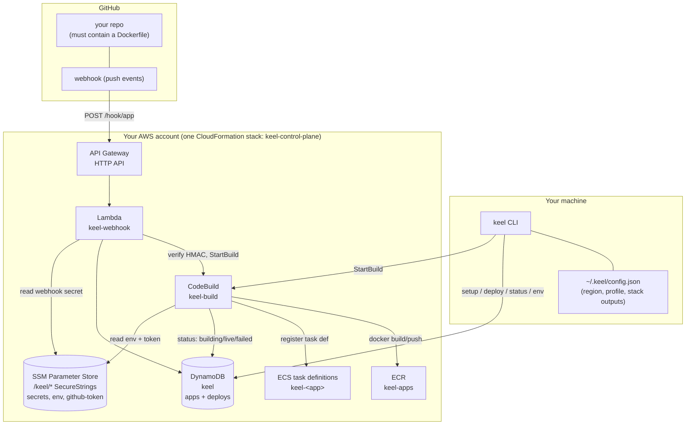
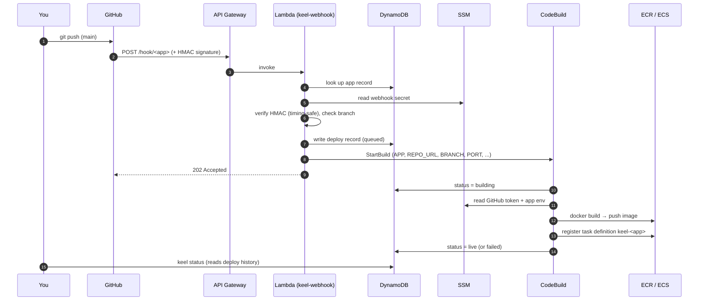
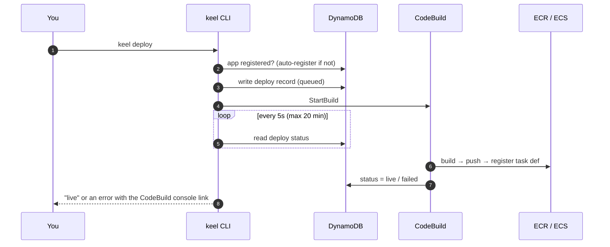

# Keel — How It Works, How To Use It, How To Test It

Keel is a self-hosted Render/Supabase replacement that deploys your apps into
**your own AWS account**. You run one setup command, and from then on a `git
push` (or `keel deploy`) builds your app and ships it to AWS — no servers to
babysit, no per-seat SaaS bill, just your AWS usage.

This guide covers the architecture, the deploy flows, and exactly how to use
and test each piece.

> **Status:** Plan B1/B2 (deploy + AWS runtime) and Phase 2 (managed Postgres)
> are complete and live-verified end-to-end. `keel deploy` builds an app and
> serves it at a real URL behind a shared load balancer; `keel logs`, `status`,
> `destroy`, env vars, and push-to-redeploy all work. `keel db create` provisions
> RDS Postgres (shared or dedicated), and linking a database to an app injects
> `DATABASE_URL` and opens a per-app firewall to it — verified with an app on
> Fargate querying Postgres and serving `db ok`. Ingress mode (port vs.
> subdomain-HTTPS) is chosen at `keel setup`. Next: Phase 3 (auth).

---

## 1. Architecture

Everything except the CLI runs inside your AWS account. The control plane is
serverless and costs ~$0/month when idle.



**What each piece is for:**

| Component | Role |
|---|---|
| `keel` CLI | Runs on your machine. Registers apps, starts builds, reads status. All AWS calls use the profile stored at setup. |
| `~/.keel/config.json` | Written by `keel setup`. Holds region, AWS profile, and the control-plane resource names. |
| DynamoDB table `keel` | Single table. App records (`PK=APP#<name>, SK=META`) and deploy records (`SK=DEPLOY#<id>`). |
| SSM Parameter Store `/keel/*` | All secrets as encrypted SecureStrings: per-app webhook secret, per-app env vars, the GitHub token. Never stored in DynamoDB, never logged. |
| Lambda `keel-webhook` | Receives GitHub pushes, verifies the HMAC signature, starts a build. |
| CodeBuild `keel-build` | The build engine. Clones the repo, `docker build`, pushes to ECR, registers the task definition, updates the deploy status. |
| ECR `keel-apps` | Stores built images, tagged `<app>` and `<app>-<commit>`. |
| ECS task definitions `keel-<app>` | One family per app; each successful build registers a new revision. |

---

## 2. The two deploy flows

### A. Push-to-deploy (automatic)

Once you've added the GitHub webhook, every push to your tracked branch ships
automatically — no CLI involved.



**Security:** the Lambda verifies the GitHub HMAC signature (`X-Hub-Signature-256`)
against the per-app secret with a constant-time comparison, over the raw body,
before parsing anything. A bad signature returns `401` and starts nothing; an
unknown app or a push to a different branch returns `204` and does nothing.

### B. Manual deploy (`keel deploy`)

Same build engine, triggered directly from your machine — useful for the first
deploy or when you want to ship without pushing.



---

## 3. How to use it

### One-time setup

Install the CLI:

```bash
npm install -g keel     # or run it without installing: npx keel <command>
keel --version
```

**Credentials — do not use root keys.** Create a dedicated IAM *user* (or better, an
IAM Identity Center / SSO profile) for keel and give it only the permissions it needs.
[`docs/iam-policy.json`](iam-policy.json) is a least-privilege starting point: it scopes
CloudFormation to `keel-*` stacks, DynamoDB to the `keel` table, SSM to `/keel/*`,
CodeBuild to `keel-*` projects, and `iam:*Role` to `keel-*` roles. Actions that AWS does
not support resource-level permissions for (most `Describe*`/`List*`) stay on `*`.

```bash
aws iam create-user --user-name keel-cli
aws iam put-user-policy --user-name keel-cli \
  --policy-name keel-cli --policy-document file://docs/iam-policy.json
```

Prefer short-lived credentials where you can — with IAM Identity Center, `aws sso login
--profile keel` and keel picks the profile up like any other. If you do use an access
key, rotate it and never commit it; keel only ever reads credentials through the AWS SDK
chain and never stores them itself.

```bash
# 1. Point the AWS CLI at the account Keel should use (a dedicated profile keeps
#    it separate from your other AWS work).
aws configure --profile keel
aws sts get-caller-identity --profile keel      # confirm it works

# 2. Create a GitHub fine-grained token (Contents: Read-only) for the repo(s)
#    Keel will build, so CodeBuild can clone private repos.

# 3. Deploy the control plane (~3 min the first time).
keel setup --profile keel --region ap-south-1 --github-token <github_pat_...>
```

`keel setup` deploys the CloudFormation stack, stores the token in SSM, and
writes `~/.keel/config.json`. The profile is remembered — every later `keel`
command uses it automatically.

### Register and deploy an app

Each app repo needs a `Dockerfile` and a `keel.json`. For AWS:

```json
{
  "name": "myapp",
  "port": 3000,
  "target": "aws",
  "branch": "main",
  "repo": "https://github.com/you/myapp",
  "dir": ".",
  "env": {},
  "healthPath": "/"
}
```

- `dir` is the subdirectory containing the Dockerfile (`.` for repo root; useful
  for monorepos).
- `keel new` writes this interactively; or write it by hand.

```bash
cd myapp/
keel deploy        # builds via CodeBuild, registers the task definition
keel status        # recent deploys: id, status, commit, timestamp
keel env set DATABASE_URL=postgres://...   # stored encrypted in SSM
keel deploy        # env changes take effect on the next deploy
```

### Enable push-to-deploy

`keel new` (or the deploy output) prints a ready-to-run `gh` command that
creates the webhook. Run it once per app:

```bash
gh api repos/you/myapp/hooks -f 'name=web' -F 'active=true' -f 'events[]=push' \
  -f 'config[url]=<webhook URL from keel>' \
  -f 'config[content_type]=json' \
  -f 'config[secret]=<secret from keel>'
```

After that, every `git push` to your tracked branch deploys automatically.

### Databases (`keel db`)

Keel can provision managed Postgres databases in the AWS account configured by
`keel setup`. Creating a database prints its connection string once, stores it
encrypted in SSM at `/keel/db/<name>/url`, and opens its firewall to your
current public IP.

```bash
# Shared isolation is the default. The first shared database provisions the
# keel-db-shared db.t4g.micro RDS instance (about 8 minutes); later databases
# on that instance are created immediately.
keel db create myapp

# Give a database a project label, or request a physically isolated RDS instance.
keel db create myapp --project payments
keel db create billing --isolation dedicated

# Free-plan AWS accounts must use one day of backup retention.
keel db create myapp --backup-days 1
```

`--isolation shared` is the default: it creates one logical database and role
on the shared `db.t4g.micro` RDS instance, `keel-db-shared`, which costs about
$13/month and is shared by all shared-mode databases. `--isolation dedicated`
creates its own `keel-db-<name>` RDS instance, also about $13/month per
database, for physical isolation. Dedicated names become the RDS instance ID
and DB name, so they cannot contain underscores, must be 55 characters or
fewer, and cannot be `postgres`.

In both modes, a name must match `^[a-z][a-z0-9_]{0,62}$`. `--backup-days`
defaults to `7`; free-plan AWS accounts cap retention at `1`, so use
`--backup-days 1` there.

```bash
# Show: name  isolation  project  host
keel db list

# Print the connection string stored in SSM.
keel db url myapp

# Re-open the database firewall after your IP changes. With no --db, this
# applies to all of your databases; omit the IP to auto-detect your current one.
keel db allow-ip
keel db allow-ip 203.0.113.10 --db myapp

# Destroy a database (asks for confirmation unless --yes is supplied).
keel db destroy myapp
keel db destroy myapp --yes
```

Destroying a shared database drops its logical database and role; destroying a
dedicated database deletes its instance stack. Both remove the SSM URL and
registry record. Destroying the last shared database leaves `keel-db-shared`
running (about $13/month); Keel prints the manual command below if you want to
remove it completely:

```bash
aws cloudformation delete-stack --stack-name keel-db-shared
```

### Connecting from your machine

Your current IP is allowlisted when the database is created, so you can connect
with `psql` directly. The URL retains `?sslmode=require` for psql/libpq.

```bash
psql "$(keel db url myapp)"
```

### Link a database to an app

Add the database name to the app's `keel.json`. On `keel deploy` for the AWS
target, Keel injects `DATABASE_URL` from SSM and opens the database firewall
to the app's security group (via the app stack, so db-linked deploys stabilize
cleanly — live-verified with a production Next.js + prisma app).

```json
{
  "name": "myapp",
  "target": "aws",
  "db": "myapp"
}
```

**TLS:** the injected `DATABASE_URL` uses `sslmode=no-verify` — encrypted, but
skipping CA verification, the same contract Heroku and Render use. RDS certs
chain to Amazon's CA, which app images don't trust out of the box, so strict
verification would fail for every driver that treats `require` as verify-full
(node-pg ≥ 8.16, prisma's pg adapter).

To opt in to full verification, ship the AWS RDS CA bundle in your image and
point `dbSslRootCert` at it — Keel then injects
`sslmode=verify-full&sslrootcert=<path>` instead:

```dockerfile
# in your Dockerfile (pick your region's bundle)
ADD https://truststore.pki.rds.amazonaws.com/ap-south-1/ap-south-1-bundle.pem /rds-ca.pem
```

```json
{
  "name": "myapp",
  "target": "aws",
  "db": "myapp",
  "dbSslRootCert": "/rds-ca.pem"
}
```

The path must be absolute (it's where the bundle lives *inside the container*).
Drivers that follow libpq's `sslrootcert` (node-pg, psycopg, prisma's pg
adapter) pick it up from the URL directly.

### Command reference

| Command | Local target | AWS target |
|---|---|---|
| `keel new` | writes keel.json | + registers the app, prints the webhook setup command |
| `keel deploy` | `docker build` + `docker run` | CodeBuild → ECR → task definition |
| `keel status` | running container | recent deploys from DynamoDB |
| `keel env set/unset/list` | edits keel.json | SSM SecureStrings (applied next deploy) |
| `keel logs` | `docker logs` | CloudWatch (`--follow` supported) |
| `keel destroy` | removes the container | deletes the app stack, records, secrets |
| `keel setup` | — | deploys the control plane |
| `keel db create <name>` | — | provisions Postgres; prints the connection URL once |
| `keel db list` | — | lists `name  isolation  project  host` |
| `keel db url <name>` | — | prints the connection URL stored in SSM |
| `keel db allow-ip [ip]` | — | allowlists an IP for all databases or `--db <name>` |
| `keel db destroy <name>` | — | removes the database after confirmation (`--yes` skips it) |

---

## 4. How to test it

### Test locally (no AWS, no cost)

The fastest way to confirm the CLI works end to end:

```bash
cd sample-app/            # target: local
keel deploy               # docker build + run
curl localhost:3000       # → hello from keel
keel status               # shows the running container
keel destroy
```

### Test the AWS build/deploy path

Point `sample-app/keel.json` at your repo (`target: aws`, `repo`, `dir:
sample-app`) and:

```bash
cd sample-app/
keel deploy
# → build started (keel-build:...) — waiting…
# → status: building
# → status: live

# Confirm the real artifacts landed:
aws ecr list-images --repository-name keel-apps --profile keel \
  --query 'imageIds[].imageTag'                      # hello, hello-<commit>
aws ecs list-task-definitions --family-prefix keel-hello --profile keel
```

### Test push-to-deploy

With the webhook added, push any commit to your tracked branch and watch a new
deploy appear without touching the CLI:

```bash
git commit --allow-empty -m "test auto-deploy" && git push
keel status                                          # a new 'live' record appears

# Confirm GitHub delivered successfully:
gh api repos/you/myapp/hooks/<hook-id>/deliveries \
  --jq '.[0] | {event, status, status_code}'         # push, OK, 202
```

### Test the failure path

A build that can't succeed (e.g. a nonexistent branch) should report `failed`,
not hang:

```bash
# In a throwaway keel.json with "branch": "no-such-branch":
keel deploy
# → status: failed
# → error: deploy failed during build — see <CodeBuild console link>
```

The deploy record in DynamoDB shows `failed`, and `keel status` reflects it.

---

## 5. Cost & teardown

- **Control plane idle:** ~$0/month. DynamoDB (on-demand), SSM standard, ECR
  (pennies for image storage), Lambda + API Gateway (per-request), CodeBuild
  (per build-minute) are all pay-per-use. There is no always-on server in B1.
- **Builds:** a few cents each (CodeBuild SMALL, ~1–2 min).
- **Running apps:** arrive in Plan B2 (Fargate tasks behind a shared load
  balancer). Nothing runs continuously yet in B1.

**Per-project cost:** every stack keel creates is tagged `keel:managed=true`, and
project-scoped stacks (apps, dedicated databases, auth) also carry
`keel:project=<name>`. CloudFormation propagates both to the resources inside the
stack, so per-project spend is a Cost Explorer query grouped by the `keel:project`
tag — no keel-side cost tracking needed. Activate the two tags once under *Billing →
Cost allocation tags* before they show up in Cost Explorer. Shared infrastructure
(control plane, ingress ALB, the shared database instance) carries only
`keel:managed` — it backs every project, so attributing it to one would be wrong.

**Teardown** (removes all control-plane resources; keeps your code):

```bash
aws cloudformation delete-stack --stack-name keel-control-plane --profile keel
```

ECR images and SSM parameters created outside the stack persist; delete the ECR
repo contents and `/keel/*` parameters separately if you want a clean slate.

---

## 6. Where things live (quick reference)

| Thing | Location |
|---|---|
| CLI config | `~/.keel/config.json` |
| App + deploy records | DynamoDB table `keel` |
| Webhook secret | SSM `/keel/<app>/webhook-secret` |
| App env vars | SSM `/keel/<app>/env/<KEY>` |
| GitHub token | SSM `/keel/github-token` |
| Built images | ECR `keel-apps` (`<app>`, `<app>-<commit>`) |
| Task definitions | ECS family `keel-<app>` |
| Build logs | CloudWatch `/keel/build` |
| App logs (B2) | CloudWatch `/keel/apps` |
| Infra definition | `infra/control-plane.yaml` (one CloudFormation stack) |
| Webhook handler | `infra/webhook-handler.cjs` (deployed inline into the Lambda) |
